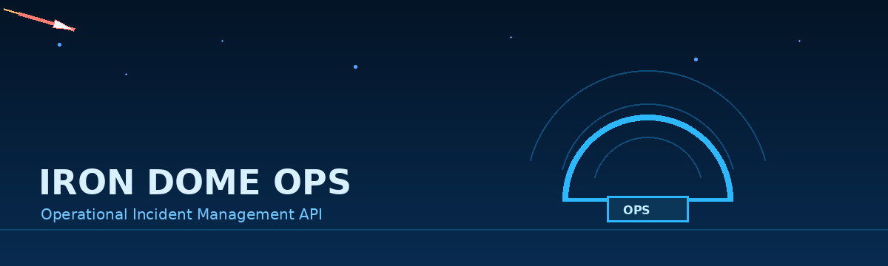
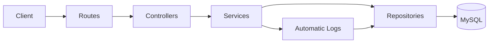
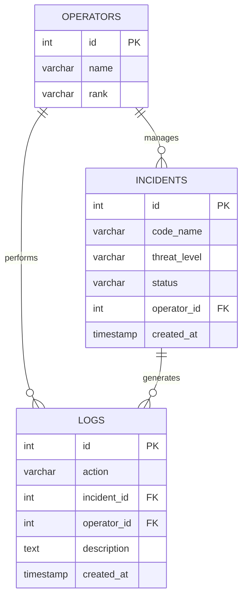

<div align="center">



# 🛡️ Iron Dome Ops

### Real-Time Operational Incident Management API

`Node.js` • `Express.js` • `MySQL` • `Docker Compose`

**REST Backend • Layered Architecture • Automatic Logs**

</div>

---

## 🔵 Mission

**Iron Dome Ops** simulates an internal operational platform used to manage real-time security incidents.

The system allows operators to:

- create operators;
- open operational incidents;
- update incident status;
- retrieve active incidents;
- automatically record important actions.

```text
Request → Route → Controller → Service → Repository → MySQL
```

---

## ⚡ Quick Start

```bash
git clone <repository-url>
cd iron-dome-project
npm install
docker compose up -d
npm run dev
```

The API will be available at:

```text
http://localhost:3000
```

<details>
<summary><strong>🔐 Environment Variables</strong></summary>

Create a `.env` file in the project root:

```env
PORT=3000

DB_HOST=localhost
DB_PORT=3307
DB_USER=root
DB_PASSWORD=root
DB_NAME=iron_dome
```

> `3307` is the port exposed on the host machine. MySQL listens on port `3306` inside the Docker container.

</details>

---

## 🚀 API Endpoints

| Method  | Endpoint                | Description                   |
| ------- | ----------------------- | ----------------------------- |
| `POST`  | `/operators`            | Create a new operator         |
| `POST`  | `/incidents`            | Open a new incident           |
| `PATCH` | `/incidents/:id/status` | Update an incident status     |
| `GET`   | `/incidents/open`       | Retrieve all active incidents |

<details>
<summary><strong>🧪 Test the API with cURL</strong></summary>

### Create an operator

```bash
curl -i -X POST http://localhost:3000/operators \
-H "Content-Type: application/json" \
-d '{"name":"John","rank":"Captain"}'
```

### Create an incident

```bash
curl -i -X POST http://localhost:3000/incidents \
-H "Content-Type: application/json" \
-d '{"codeName":"RED SKY","threatLevel":"HIGH","operatorId":1}'
```

### Update the incident status

```bash
curl -i -X PATCH http://localhost:3000/incidents/1/status \
-H "Content-Type: application/json" \
-d '{"status":"INTERCEPTED"}'
```

### Retrieve active incidents

```bash
curl -i http://localhost:3000/incidents/open
```

</details>

---

## 🧭 Allowed Values

### Threat Levels

```text
LOW · MEDIUM · HIGH · CRITICAL
```

### Incident Statuses

```text
OPEN · TRACKING · INTERCEPTED · CLOSED
```

An incident is considered **active** as long as its status is not `CLOSED`.

---

## 🧱 Architecture



```text
src/
├── controllers/
├── db/
├── middleware/
├── repositories/
├── routes/
├── services/
├── utils/
└── app.js
```

### Layer Responsibilities

| Layer        | Responsibility                             |
| ------------ | ------------------------------------------ |
| Routes       | Define endpoints only                      |
| Controllers  | Handle requests and responses              |
| Services     | Apply business logic and validation        |
| Repositories | Execute MySQL queries                      |
| Middleware   | Handle errors and shared request logic     |
| Database     | Manage initialization and connection pools |

---

## 🗄️ Database Structure



### Relationships

```text
incidents.operator_id → operators.id
logs.operator_id      → operators.id
logs.incident_id      → incidents.id
```

---

## 🧾 Automatic Logs

The service layer automatically records important actions.

| Event             | Action             | Description             |
| ----------------- | ------------------ | ----------------------- |
| Incident creation | `INCIDENT_CREATED` | `New incident created`  |
| Status update     | `STATUS_UPDATED`   | `Status changed to ...` |

Example:

```json
{
  "action": "STATUS_UPDATED",
  "incident_id": 1,
  "operator_id": 1,
  "description": "Status changed to INTERCEPTED"
}
```

---

## 📦 Main Dependencies

```bash
npm install express mysql2 dotenv
npm install --save-dev nodemon
```

| Package   | Purpose                              |
| --------- | ------------------------------------ |
| `express` | HTTP server and routing              |
| `mysql2`  | Promise-based MySQL connection       |
| `dotenv`  | Environment variable loading         |
| `nodemon` | Automatic restart during development |

---

## 🛠️ Useful Commands

```bash
npm start
npm run dev

docker compose up -d
docker compose down
docker compose restart
docker compose logs -f
docker ps
```

Connect directly to MySQL:

```bash
docker compose exec sql mysql -u root -p
```

Then enter the configured root password.

---

## ✅ Error Handling

The API handles the following cases:

- missing or invalid operator data;
- invalid operator ID;
- operator not found;
- incident not found;
- invalid threat level;
- invalid incident status;
- database connection failure;
- unknown route.

Standard error response:

```json
{
  "status": "error",
  "message": "Incident not found"
}
```

Example validation error:

```json
{
  "status": "fail",
  "message": "Status must be one of: OPEN, TRACKING, INTERCEPTED, CLOSED"
}
```

---

## 🔄 Main Workflows

### Create an Incident

```text
Receive request
      ↓
Validate code name and threat level
      ↓
Validate operator ID
      ↓
Verify that the operator exists
      ↓
Create incident with status OPEN
      ↓
Create INCIDENT_CREATED log
      ↓
Return the created incident
```

### Update Incident Status

```text
Receive incident ID and new status
      ↓
Validate incident ID
      ↓
Verify that the incident exists
      ↓
Validate the new status
      ↓
Update the incident
      ↓
Create STATUS_UPDATED log
      ↓
Return the updated incident
```

---

## 🧪 Suggested Test Cases

```text
✔ Create a valid operator
✔ Reject an operator with missing data
✔ Create an incident with an existing operator
✔ Reject an incident with an unknown operator
✔ Reject an invalid threat level
✔ Update an existing incident status
✔ Reject an invalid status
✔ Reject an unknown incident ID
✔ Retrieve all non-closed incidents
✔ Verify automatic logs in MySQL
```

---

## 🐳 Docker Configuration

Example `docker-compose.yml`:

```yaml
services:
  sql:
    image: mysql:9
    container_name: sqlIronDome
    restart: always
    ports:
      - "3307:3306"
    volumes:
      - mysqldata:/var/lib/mysql
    environment:
      MYSQL_ROOT_PASSWORD: root

volumes:
  mysqldata:
```

---

## 📈 Future Improvements

Possible next steps:

- database transactions for incident creation and log creation;
- request validation middleware;
- pagination for incident lists;
- filtering by threat level and operator;
- authentication and authorization;
- automated tests;
- API documentation with Swagger;
- graceful shutdown of the MySQL pool;
- production-ready Docker image for the Node.js application.

---

<div align="center">

### 🔷 Built for clarity, reliability, and operational control

**Iron Dome Ops — Detect. Track. Intercept. Log.**

</div>
